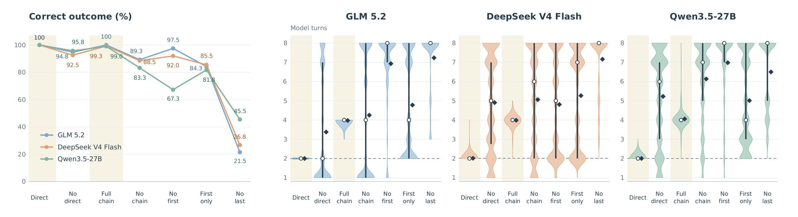
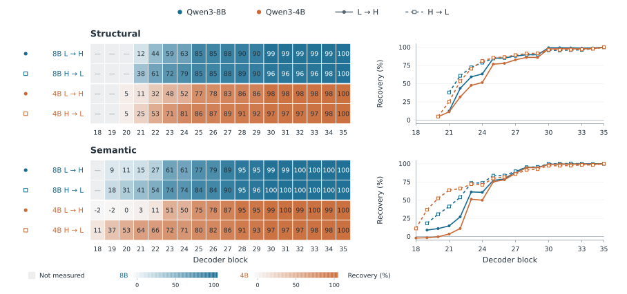

# AvaBench: When Local Progress Misleads

Code and compact experimental results for **When Local Progress Misleads: Measuring How Reachability Judgments Affect Action Control in External Tool-Calling Language Models**.

AvaBench studies a *partial affordance trap*: tools can execute successfully even when the user's goal cannot be reached. Controlled environments expose the behavior; paired action scores and residual replacement examine the model states behind it.

| Experiment | Code | Paper |
|---|---|---|
| Controlled environments: missing operations and wrong-state actions | [environments/](environments/README.md) | Sections 3–4; Figures 2–3; Appendix B |
| Stage 1: sequence scores and stopping margins | [stage1/](stage1/README.md) | Section 5.2; Tables 4–5, 7 |
| Stage 2: residual replacement and donor comparisons | [stage2/](stage2/README.md) | Section 5.3; Figure 4; Table 6 |



The experiments connect three observations: agents keep acting on unreachable tasks, missing capability or successful feedback changes stopping evidence, and transferring the resulting residual state changes action preference.

## Contents

- [Quick start](#quick-start)
- [Repository layout](#repository-layout)
- [Controlled environments and behavioral experiments](#controlled-environments-and-behavioral-experiments)
- [Stage 1: action scores and stopping evidence](#stage-1-action-scores-and-stopping-evidence)
- [Stage 2: residual replacement](#stage-2-residual-replacement)
- [Reading the results](#reading-the-results)

## Quick start

Use Python 3.10 and run all commands from the repository root. The environment and API runner use the standard library; plotting and local-model dependencies are separate installation options.

```bash
python -m venv .venv
source .venv/bin/activate
python -m pip install --upgrade pip
python -m pip install -e '.[analysis]'
python -m analysis.reproduce
```

This rebuilds tables and plots from the included compact results without API calls or model downloads. Expected outputs are:

| Output under `outputs/paper/` | Contents |
|---|---|
| `figures/figure2.{png,pdf,svg}` | Structural accuracy and interaction length |
| `figures/figure3.{png,pdf,svg}` | Semantic accuracy and interaction length |
| `figures/figure4.{png,pdf,svg}` | Recovery across decoder blocks, with heatmaps and curves |
| `tables/behavior_summary.csv` | Accuracy and interaction length for every condition and model |
| `tables/terminal_states.csv` | Termination category crossed with remaining wrong state |
| `tables/stage1_summary.csv` | Paired stopping margins across all contrasts |
| `tables/recognition_action_gap.csv` | Stopping evidence among budget-exhausted cases |
| `tables/stage2_{layers,bands,controls}.csv` | Layer effects, late-block averages, and donor comparisons |
| `tables/table{4,5,6,7}.tex`, `tables/tableB{1,2}.tex` | LaTeX table bodies, using `booktabs` |

The plots reproduce the numerical comparisons with a common plotting layout. The manuscript artwork is in [`assets/`](assets/); the numerical table snapshots are in [`results/tables/`](results/tables/).

## Repository layout

```text
environments/          Build the controlled environments and run API evaluations
stage1/                Replay construction, local Qwen inference, action scoring
stage2/                Residual capture, replacement, and same-condition donors
src/envtoolbench/       Shared executable tools, state transitions, and evaluator
data/                  Fixed tasks, tool registries, paper cohorts, donor assignments
results/               Compact case, score, and intervention data; paper tables
analysis/              Rebuild summaries and figures from recorded or new results
assets/                Figures used in the manuscript
models/                Downloaded weights (created locally)
outputs/               New experiment outputs (created locally)
```

The repository includes 400 structural tasks, 350 semantic tasks, executable environment resources, paper cohort membership, and compact results. Model weights and newly generated trajectories or activations belong in `models/` and `outputs/`, which are excluded from Git.

## Controlled environments and behavioral experiments

Build the deterministic resources and example model inputs:

```bash
python -m environments.build
```

Expected outputs are `outputs/environments/{structural,semantic}/{registry,queries,example_inputs}.json`. The registries include the executable resources; the fixed queries retain the wording used in the experiments. Example inputs show the tools and messages for each condition on one task.

There are **400 structural tasks × 7 conditions** and **350 semantic tasks × 4 conditions**, or **4,200 interactions per model**. Structure removes required operations at different positions. Semantics changes whether the goal-matching action is present and whether an available decoy succeeds in changing the wrong field. The interaction budget is eight model turns, six environment calls, and one restart.

For an API run, set the provider endpoint and key, then select a model:

```bash
export AVABENCH_API_BASE='https://your-provider.example/v1'
export AVABENCH_API_KEY='your-api-key'
python -m environments.run --model glm-5.2 --family both
```

The paper presets are `glm-5.2` and `deepseek-v4-flash` through DeepInfer, and `qwen3.5-27b` through SiliconFlow. Set the endpoint and key for the selected provider. The corresponding adapters retain thinking-enabled requests and the generation settings in [`environments/api_settings.json`](environments/api_settings.json). Run the command once per model to reproduce the **12,600-interaction** matrix.

Results are written incrementally to `outputs/behavior/<model>/{structural,semantic}_cases.csv`. Add `--resume` to continue the same run, `--limit 2` to run the first two tasks per family, or `--save-trajectories` to retain new dialogues locally. [Environment details and condition names](environments/README.md).

To plot newly collected behavioral results:

```bash
python -m analysis.reproduce --sections behavior \
  --behavior outputs/behavior --output outputs/new_behavior
```

## Stage 1: action scores and stopping evidence

Install the local-model dependencies. The reference setup used one RTX 4090, BF16, and SDPA; run the two models sequentially.

```bash
python -m pip install torch==2.6.0 --index-url https://download.pytorch.org/whl/cu118
python -m pip install -e '.[mechanisms,analysis]'
python -m stage1.download_models
python -m stage1.run prepare
```

The download command places the recorded Qwen3-8B/4B revisions in `models/`. To use existing weights, pass `--model-dir /path/to/Qwen3-8B` or its 4B counterpart to each model command.

`prepare` constructs matched contexts by executing the relevant environment steps. It uses the included paper cohorts and produces `outputs/stage1/pairs/semantic.jsonl` and `outputs/stage1/pairs/<model>/structural.jsonl`. Both models use **350 semantic pairs**; the structural sets contain **1,306 distinct pairs for 8B** and **837 for 4B** across four contrasts. Two-step chains whose No last condition duplicates First only are scored once.

```bash
python -m stage1.run score --model qwen3-8b
python -m stage1.run score --model qwen3-4b
```

Each model produces `outputs/stage1/<model>/context_scores.jsonl` and `pair_effects.csv`. A candidate score sums log probabilities through the complete function name. The stopping margin compares `unavailable` with the combined alternatives. Structural comparisons average visible tool probabilities before adding `finish` and `restart`; semantic comparisons sum all alternative probabilities directly.

Expected paper patterns: No last increases the mean margin by **10.66 / 14.44** for 8B/4B, while the missing-condition means remain negative. Decoy success reduces the margin by **11.22 / 5.76**, with a decrease in every semantic pair. [Scoring equations and optional qualification reruns](stage1/README.md).

```bash
python -m analysis.reproduce --sections stage1 \
  --stage1 outputs/stage1 --output outputs/new_stage1
```

## Stage 2: residual replacement

Stage 2 uses the replay contexts from `prepare`; it can run independently of Stage 1 scoring. It compares the final required operation with `unavailable` for structure, and `finish` with `unavailable` for semantics.

```bash
python -m stage2.run all --model qwen3-8b
python -m stage2.run all --model qwen3-4b
```

For each model, the command captures residual states, replaces them between paired contexts in both directions, and runs same-condition donor comparisons. Output files under `outputs/stage2/<model>/` are:

| Output | Contents |
|---|---|
| `activations/<family>/` | Locally generated residual tensors and clean preferences |
| `<family>_paired_effects.csv` | Clean donor/recipient preferences, patched preference, effect, and gap |
| `<family>_control_effects.csv` | Matched and random cross-task donors under the recipient's own condition |

L35 comparisons use **186 structural pairs and 350 semantic pairs per model**. Layer sweeps use the paper's complementary subset: **87 structural pairs and 175 semantic pairs per model**. Blocks are numbered from zero. Late-block ranges are L21–35 / L20–35 for structural 8B/4B and L19–35 / L18–35 for semantic 8B/4B.

The full run produces **19,788 paired intervention rows** and **4,288 same-condition intervention rows** across both models. Expected late-block recovery is **82.75% / 75.36%** for structure and **75.22% / 70.36%** for semantics. Recovery increases in later blocks, while same-condition donor effects remain much smaller.

```bash
python -m analysis.reproduce --sections stage2 \
  --stage2 outputs/stage2 --output outputs/new_stage2
```



[Intervention equations, separate execution steps, and donor assignment](stage2/README.md).

## Reading the results

Behavioral **accuracy** means successful completion in reachable conditions and a correct declaration of unavailability in unreachable conditions. **Budget exhausted** means neither outcome occurred before the interaction limit. **Residual wrong state** records whether an incorrect state change remains after stopping; the read-only structural experiments have no such category.

Stage 1 averages stopping margins over task pairs. In Stage 2, effects and clean gaps are averaged within each pair, then within each task group, and finally across groups with equal weight. Recovery is the ratio of those aggregate means, rather than the average of individual recovery ratios. [`results/README.md`](results/README.md) maps the retained data to the manuscript.
